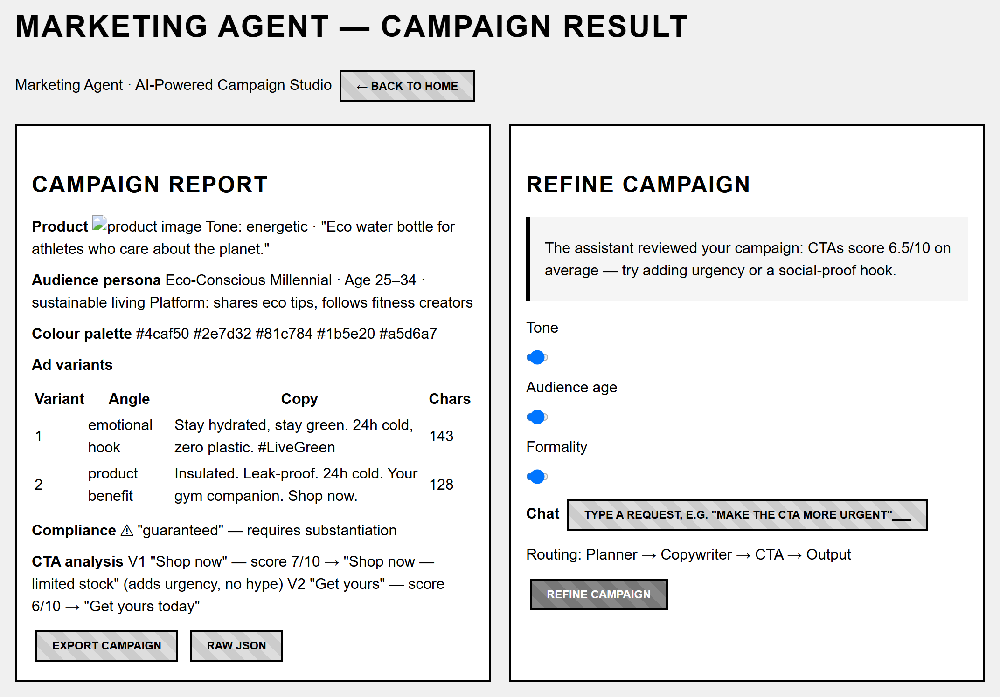

# Marketing Agent — Result Page Wireframe

This is the design of the campaign result page: the two-column layout where
a user reads the finished campaign and refines it. It was drawn before
`templates/result.html` was coded, so the layout decisions below were made
on purpose, not discovered after the fact. The rendered wireframe is
`diagrams/wireframe-result-page.png` (authored in wiremd from
`diagrams/wireframes/result-page.wmd.md`).

## The layout

The page is two columns. On the left is the campaign report — product,
audience persona, colour palette, the two ad variants, compliance flags,
and CTA analysis. On the right is a sticky refinement panel — three
sliders, a chat box, a visible routing label, and a Refine button. The two
work together: the report and the refinement panel are in use at the same
time, so they sit side by side rather than on separate tabs.

## Decisions and why

1. **The right panel is sticky.** The report is long and scrolls; the
   refinement controls should always be reachable without scrolling back
   to the top. The user reads copy and refines it in the same view.

2. **Sliders sit above the chat, not below.** A slider change is
   deterministic and instant to reason about — it should be the first
   thing a user tries, because it is cheap and reversible. Chat is for
   free-form requests that need the slower, reasoning path.

3. **The routing label is visible** (for example "Routing: CTA →
   Output"). The brief asks for visible agent collaboration, so the user
   must see which agents run on each refine, not just watch the output
   change. This is what makes the multi-agent structure legible.

4. **The proactive suggestion appears on page load**, not after the user
   asks. The assistant reviews the campaign immediately and surfaces two or
   three improvements, the way an account manager reviews creative before
   the client does. The user does not need to know what to ask first.

5. **Two columns, not tabs or a single stack.** Tabs would force switching
   back and forth; a stacked layout would mean scrolling past the whole
   report to reach the panel. Side by side keeps both in view — the same
   pattern as a code editor with a live preview.

6. **Each variant is labelled with its angle** ("emotional hook" /
   "product benefit"). The copywriter is forced to write two distinct
   angles; labelling them tells the user *why* the variants differ, which
   helps when deciding which one to iterate on.

7. **A character count is shown per variant.** Copy has a length limit, and
   a refinement can push a variant over it, so the count updates after each
   refine.

8. **Export sits at the bottom of the report.** The user reads the full
   report before deciding to export; bottom placement is the natural end of
   the reading flow, rather than inviting a download before review.

## Narrow screens

Below about 768px the two columns stack: the report runs full width, then
the refinement panel below it, docked as a bottom drawer. The routing label
is hidden on narrow screens for space.

## Interaction states

- **Load** — sliders show current values; the chat shows the proactive
  suggestion from `/suggest`.
- **Slider moved** — the value updates live in the browser; no server call
  until Refine is clicked.
- **Refining** — the Refine button is disabled and the routing label shows
  what is running.
- **Done** — only the affected report sections are patched in place, the
  routing label shows what ran, and the chat summarises what changed.
- **Error** — the chat shows the message; the report is left unchanged.

## Where this lives in the code

- `templates/result.html` — the page itself
- `agents/assistant.py` — the suggestions and routing behind it
- `app.py` — the `/suggest` and `/refine` endpoints
